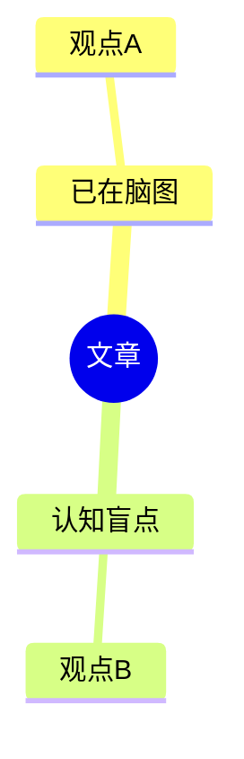

# md-understand

Turn a (cleaned) Markdown article into a knowledge-base-ready note by adding two leading sections and cross-referencing the `perso` mind maps.

If the article still has web clipping boilerplate or `![[...]]` embeds, run the `md-clean` skill first.

## Perso knowledge base

Root: `persospace/perso` (relative to the persospace workspace). Categories:

| Category | Directory | Fits articles about |
|----------|-----------|---------------------|
| belief | `perso/10_belief` | 信念、价值观、世界观、人生观、身份认同 |
| thinking-framework | `perso/20_thinking-framework` | 思维方式、认知框架、心智模型、学习方法、决策 |
| self-management | `perso/30_self-management` | 自我管理、目标、时间、精力、习惯、效率、健康 |
| eq | `perso/40_eq` | 情商、沟通、表达、人际关系、演讲 |

## Workflow

```
- [ ] Step 1: Read the article
- [ ] Step 2: Write the Abstract (first section)
- [ ] Step 3: Classify into one perso category if category is not identifed. if category is identified, use the identified category. 
- [ ] Step 4: Load that category's OPML mind map
- [ ] Step 5: Compare article vs. mind map, insert as a chapter after Abstract
- [ ] Step 6: Verify
```

### Step 1: Read the article

Read the whole file. Keep the YAML frontmatter unchanged. Note the article's language — **all inserted sections must match the article's language** (e.g. Chinese article → Chinese headings/content).

### Step 2: Abstract

Insert as the **first section after the frontmatter**, before the existing body. Summarize the core thesis and 3–7 main points. Do not paraphrase the whole article — capture the essence.

```markdown
## Abstract

> 一句话核心论点。

- 主要观点 1
- 主要观点 2
- 主要观点 3
```

### Step 3: Classify

Pick **exactly one** category from the table above (best fit). State the chosen category and a one-line reason.

### Step 4: Load the mind map

Find an OPML file in the chosen category directory:

```bash
ls "persospace/perso/<category-dir>/"*.opml 2>/dev/null
```

If one exists, extract its readable outline (do NOT read the raw XML — it is large and URL-encoded):

```bash
python3 scripts/opml_outline.py "persospace/perso/<category-dir>/<file>.opml"
# --flat  : one node per line (handy for matching)
# --notes : also show node notes
```

If **no** OPML exists in that category, skip Step 5, keep the Abstract, and tell the user the category has no mind map yet.

### Step 5: Compare → insert chapter after Abstract

Extract the article's key viewpoints (reuse the Abstract points plus any notable sub-claims). For each, decide whether the mind map already represents it. Insert this chapter **immediately after the Abstract**:

```markdown
## 与脑图对比（<category>）

对比脑图：`perso/<category-dir>/<file>.opml`

| 文章观点 | 脑图中是否已有 | 对应脑图节点 / 说明 |
|----------|----------------|----------------------|
| 观点 A | ✅ 已有 | 对应节点路径 |
| 观点 B | ❌ 未提及 | — |

**脑图未覆盖的认知盲点：**

- 盲点 1（文章有、脑图无）
- 盲点 2
```

Optionally add a Mermaid comparison diagram when it aids clarity:

```markdown

```

Guidance:
- "认知盲点" = viewpoints present in the article but absent from the mind map.
- Match on meaning, not exact wording. Cite the mind map node path when a match exists.
- When unsure whether a node counts as a match, mark it as partial (⚠️) and explain.

### Step 6: Verify

- Frontmatter unchanged; `## Abstract` is the first section; the comparison chapter directly follows it; original body untouched below.
- Inserted content is in the article's language.
- Chosen category and OPML path are stated in the comparison chapter.

## Notes

- Edit the file in place unless asked for a copy.
- Only add the two sections; never rewrite the article body.
- `opml_outline.py` reads the `text` attribute of each `<outline>` node and prints an indented tree.
